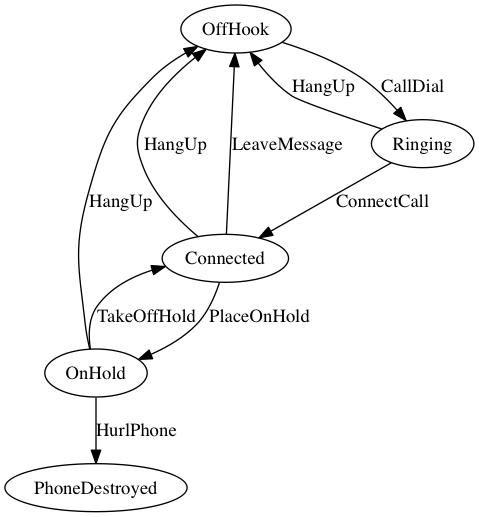

# A State Machine implementation in Java

Simple State Machine with transitions, guards, actions.

...but without composite state, sub-state machine, deferred signals, event queues...

Define the State Machine by subclassing State Machine and using the builders in the constructor. Se tests for usage.

<!-- language: lang-java -->
        State onHold = state(ON_HOLD)
                .transition(HURL_PHONE).guardedBy(event -> PHONE_HURLED_AGAINST_WALL.equals(event.getName()))
                .to(phoneDestroyed)
                .transition(HANG_UP).guardedBy(event -> HUNG_UP.equals(event.getName()))
                .to(offHook)
                .transition(TAKE_OFF_HOLD).onTransition(stopMuzak).guardedBy(event -> TOOK_OFF_HOLD.equals(event.getName()))
                .to(connected)
                .build();

## State Machine used in the unit tests

### Phone State Machine Diagram
Inspired by [simplestatemachine](http://simplestatemachine.codeplex.com/)

**Phone State Machine**   
Generated from code by [Graphviz](http://www.graphviz.org/) using toDot() in StateMachine  
´´´
dot -Tjpg -o <filename of image> <file with dot format>
´´´

